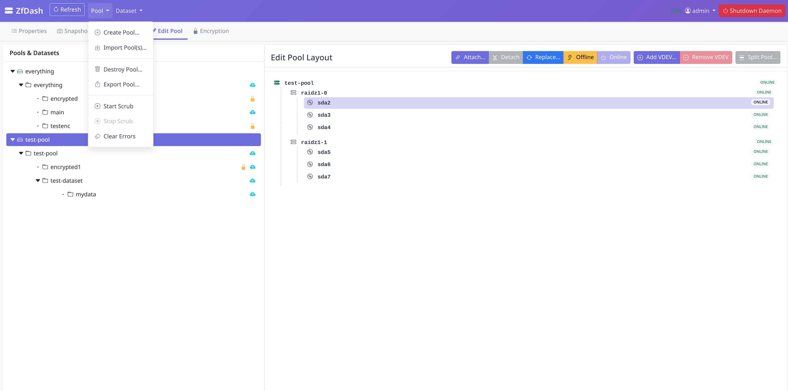
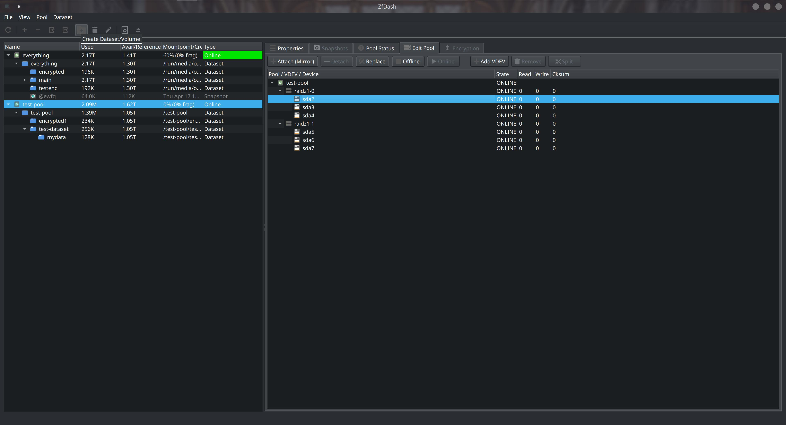

# ZfDash (v1.8.9-beta)
**(ZFS Management GUI / WEBUI) 💻** (Currently In Testing Phase) 
# Updating

**To update:** just run the new installer again `curl -sSL https://raw.githubusercontent.com/ad4mts/zfdash/main/get-zfdash.sh | bash` (it handles upgrades). For Docker, stop and remove the old container before pull/run the new one (instructions below).

**v1.8.7-beta and later:** Check for updates anytime from the Help menu in the GUI or Web UI with newest instructions.


[](https://www.gnu.org/licenses/gpl-3.0)

ZfDash provides user interfaces (both a Desktop GUI and a Web UI) built with Python to simplify common ZFS pool, dataset, and snapshot management tasks on Linux. It interacts with a secure background daemon, launched on demand via Polkit, to perform ZFS operations.

---

** DISCLAIMER **
* **User Responsibility:** You are solely responsible for understanding the ZFS commands being executed by this tool and for the integrity of your data. **ALWAYS HAVE RELIABLE, TESTED BACKUPS** of critical data before performing any operations. Using this tool can lead to **PERMANENT DATA LOSS** if not used carefully.

---

## Table of Contents

* [✨ Features](#-features)
* [📸 Screenshots](#-screenshots)
* [⚙️ Requirements](#️-requirements)
* [🚀 Installation & Running](#-installation--running)
* [🐳 Docker Usage](#-docker-usage)
* [💡 Usage Tutorial](#-usage-tutorial)
* [💖 Motivation](#-motivation)
* [⚠️ IMPORTANT WARNINGS](#️-important-warnings)
* [📄 License](#-license)

## ✨ Features

*   🔒 Secure backend daemon (Polkit/`pkexec`) & pipe/socket communication.
*   💻 Desktop GUI (PySide6) & 🌐 Web UI (Flask/Waitress) with secure login (Flask-Login, PBKDF2).
*   📊 Pool Management: View status, Create (various vdevs), Destroy, Import, Export, Scrub, Clear errors, Edit structure (Add/Remove/Attach/Detach/Replace/etc.), Force option.
*   🌳 Dataset/Volume Management: Tree view, Create/Destroy (recursive), Rename, View/Edit properties, Inherit, Promote, Mount/Unmount.
*   📸 Snapshot Management: View, Create (recursive), Delete, Rollback, Clone.
*   🔐 Encryption Support: Create encrypted datasets, View status, Manage keys (Load/Unload/Change).
*   📜 Utilities: Optional command logging.

## 📸 Screenshots

**Web UI:**




**Desktop GUI:**



## ⚙️ Requirements

* **Supported Platforms:** Linux (x86_64 and ARM64).
* **Experimental/Unsupported:** macOS and FreeBSD are NOT officially supported yet. You may try running from source (Method 2 with --socket mode), but GUI features (PySide6) are disabled on FreeBSD, and ZFS command compatibility is not guaranteed.
* **ZFS installed and configured** (Tested with zfs-2.3.1. `zfs` and `zpool` commands must be executable by root).
* **Python 3** (Developed/Tested with 3.10-3.13).
* **Python Dependencies (for Build/Manual Run only):** Listed in `pyproject.toml` (PySide6 for GUI, Flask, Waitress, Flask-Login for WebUI). The build script uses [uv](https://docs.astral.sh/uv/) for fast, cross-platform dependency management.

## 🚀 Installation & Running

*Default WebUI: http://127.0.0.1:5001, Login: `admin`/`admin` (CHANGE IMMEDIATELY!)*

**Method 1: Pre-Built Release (linux `amd64`and `arm64` only for now)**
Run this command to automatically download and install/update-to the latest version for your system:
```bash
curl -sSL https://raw.githubusercontent.com/ad4mts/zfdash/main/get-zfdash.sh | bash
```

*  Launch GUI: App Menu/`zfdash`, Launch Web UI: `zfdash --web [--host <ip>] [--port <num>]`, Help: `zfdash --help`
*  Uninstall: `sudo /opt/zfdash/uninstall.sh` (*Note: Installer usually makes this executable*)


or download latest release tar for your system and run install.sh.

**Method 2: Run From Source with uv (Cross-Platform)**

1.  Install [uv](https://docs.astral.sh/uv/): `curl -LsSf https://astral.sh/uv/install.sh | sh`
2.  `git clone https://github.com/ad4mts/zfdash && cd zfdash`
3.  Run GUI: `uv run src/main.py`
4.  Run Web UI: `uv run src/main.py --web` or `uv run src/main.py --web --socket` for macos/freebsd> sudo required on these

    **Note:**
     macOS and FreeBSD are not officially supported yet. Please report issues if you test on these platforms. see: `uv run src/main.py --help`.
    

* Troubleshooting: If the daemon won't start due to Polkit/policy issues, copy the packaged policy into the system actions directory:
```bash
sudo cp src/data/policies/org.zfsgui.pkexec.daemon.launch.policy /usr/share/polkit-1/actions/
sudo chown root:root /usr/share/polkit-1/actions/org.zfsgui.pkexec.daemon.launch.policy
sudo chmod 644 /usr/share/polkit-1/actions/org.zfsgui.pkexec.daemon.launch.policy
```
then retry.

**Method 3: Build From Source (Desktop/Manual WebUI)**
1.  `git clone https://github.com/ad4mts/zfdash && cd zfdash`
2.  `chmod +x build.sh`
3.  `./build.sh` (Automatically installs uv and builds)
4.  `chmod +x install.sh`
5.  `sudo ./install.sh`
6.  Launch/Uninstall: See Method 1.

**Method 4: Docker (Only Web UI)**
Running zfdash in a privileged Docker container.

## 🐳 Docker Usage

This is the recommended method for deploying the ZfDash Web UI.

### 1. Pull the Image from a Registry

The image is available on both Docker Hub and GitHub Container Registry (GHCR). Docker Hub is the recommended source.

*   **From Docker Hub (Recommended):**
    ```bash
    sudo docker pull ad4mts/zfdash:latest
    ```

*   **From GitHub Container Registry (Alternative):**
    ```bash
    sudo docker pull ghcr.io/ad4mts/zfdash:latest
    ```

### 2. Run the Container

This command starts the container and uses Docker **named volumes** (`zfdash_config` and `zfdash_data`) to safely persist your application's configuration and data.

```bash
sudo docker run -d --name zfdash \
  --privileged \
  --device=/dev/zfs:/dev/zfs \
  -v zfdash_config:/root/.config/ZfDash \
  -v zfdash_data:/opt/zfdash/data \
  -v /etc:/host-etc:ro \
  -p 5001:5001 \
  --restart unless-stopped \
  ad4mts/zfdash:latest
```

A Docker Compose stack is also [included](compose.yml). To use that instead of the above Docker command:
```bash
sudo docker compose up -d
```

You can then access the Web UI at `http://localhost:5001`.

Stopping and removing the container, if deployed with the Docker command:
```bash
sudo docker stop zfdash
sudo docker rm zfdash
```

Or if deployed with Docker Compose (add `-v` to remove the volumes as well):
```bash
sudo docker compose down
```


### Docker Security Note (Advanced)

ZfDash requires direct access to the host's ZFS subsystem, which presents a security challenge for containerization.

*   **`--privileged` Flag**: The command above uses `--privileged`, which grants the container full, unrestricted access to the host. This is the simplest way to ensure functionality but is also the least secure.
*   **A More Secure Alternative**: For better security, you can replace `--privileged` with the more granular `--cap-add SYS_ADMIN` flag and mount /dev as volume using `-v /dev:/dev` (so the container has access to disks). If you still encounter permission errors (often due to AppArmor or SELinux policies on the host), you may also need to add `--security-opt seccomp=unconfined` as a last resort.
    * If using Docker Compose, use the included [compose.moresecure.yml](compose.moresecure.yml) to as an override and redeploy:
      ```bash
      mv compose.moresecure.yml compose.override.yml
      docker compose up -d
      ```

**HostID Compatibility Note**: ZFS pools store the system hostid they were created on. To prevent hostid mismatch errors, the container syncs with the host's `/etc/hostid` via the `-v /etc:/host-etc:ro` mount (already included in compose files). This works across all distributions, handling missing hostid files gracefully.

**Method 5: Web UI Systemd Service (Headless/Server)**
Note: (Polkit<0.106 is not supported for now, ie older Distros)
1.  Install ZfDash via Method 1 or 3 first.
2.  `cd install_service`
3.  `chmod +x install_web_service.sh`
4.  `sudo ./install_web_service.sh` (Follow prompts for setup)
5.  Control: `sudo systemctl [start|stop|status|enable|disable] zfdash-web`
6.  Access: `http://<server-ip>:5001` (or configured port/host)
7.  Uninstall Service: `cd install_service && chmod +x uninstall_web_service.sh && sudo ./uninstall_web_service.sh`

## 💡 Usage Tutorial

*   **Launch:** Follow installation steps. For Web UI, login (`admin`/`admin`) and **CHANGE PASSWORD IMMEDIATELY** via user menu.
*   **Navigation:** Left pane shows ZFS object tree. Right pane shows details/actions for selected object via tabs (Properties, Snapshots, etc.). Top bar/menu has global actions (Refresh 🔄, Create, Import) & Web UI user menu.
*   **Common Tasks:** Select object in tree, use right pane tabs or top bar/menu buttons. Examples: Check Pool Status/Properties tabs for health/usage. Use Snapshots tab to create/delete/rollback/clone. Use top bar/menu to create datasets. Use Encryption tab to manage keys.
*   **Remember:** Destructive actions are irreversible. Double-check selections & keep backups!

## 💖 Motivation

As a resident doctor, my main focus isn't software, but I enjoy exploring Python, Linux, and security as a hobby. ZfDash grew out of this hobby and my own need for a simpler way to manage my ZFS storage.

With some help from AI tools, I built this GUI/WebUI and decided to share it with the open-source community, hoping it might help others too. I'll do my best to maintain it, but my time is limited, so please feel free to fork the project if you'd like to expand on it!


## ⚠️ IMPORTANT WARNINGS

*   **Developer Note:** Created as a personal hobby project by a non-professional; use with understanding of potential limitations or bugs.
*   **Use As Is / Beta:** Provided "AS IS" without warranty. This is beta software and may contain errors.
*   **No Liability:** In no event shall authors/copyright holders be liable for any claim, damages, or other liability related to the software.
*   **Data Risk:** ZFS operations can be destructive (destroy, rollback, etc.). Careless use can lead to **PERMANENT DATA LOSS**.
*   **User Responsibility:** You are solely responsible for understanding the commands executed and for data integrity. **ALWAYS HAVE RELIABLE, TESTED BACKUPS.**
*   **Security:** Manages privileged operations via Polkit. Use only on trusted systems/networks. **CHANGE DEFAULT PASSWORD (`admin:admin`) IMMEDIATELY.**


## 📄 License

This project is licensed under the General Public License v3.0 License.
