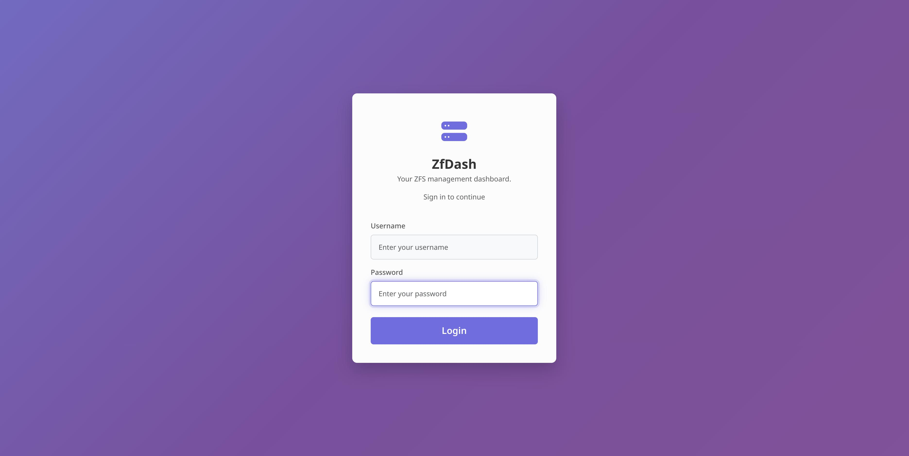

# ZfDash (v1.7.6-Beta)
**(ZFS Management GUI / WEBUI) 💻** 
**⚠️ Beta Software - Currently In Testing Phase ⚠️**

ZfDash provides user interfaces (both a Desktop GUI and a Web UI) built with Python to simplify common ZFS pool, dataset, and snapshot management tasks on Linux. It interacts with a secure background daemon, launched on demand via Polkit, to perform ZFS operations.

---

** DISCLAIMER **
* **User Responsibility:** You are solely responsible for understanding the ZFS commands being executed by this tool and for the integrity of your data. **ALWAYS HAVE RELIABLE, TESTED BACKUPS** of critical data before performing any operations. Using this tool can lead to **PERMANENT DATA LOSS** if not used carefully.

---

## Table of Contents

* [✨ Features](#-features)
* [📸 Screenshots](#-screenshots)
* [⚙️ Requirements](#️-requirements)
* [🚀 Installation & Running](#-installation--running)
* [💡 Usage Tutorial](#-usage-tutorial)
* [💖 Motivation](#-motivation)
* [⚠️ IMPORTANT WARNINGS](#️-important-warnings)
* [📄 License](#-license)

## ✨ Features

*   🔒 Secure backend daemon (Polkit/`pkexec`) & pipe communication.
*   💻 Desktop GUI (PySide6) & 🌐 Web UI (Flask/Waitress) with secure login (Flask-Login, PBKDF2).
*   📊 Pool Management: View status, Create (various vdevs), Destroy, Import, Export, Scrub, Clear errors, Edit structure (Add/Remove/Attach/Detach/Replace/etc.), Force option.
*   🌳 Dataset/Volume Management: Tree view, Create/Destroy (recursive), Rename, View/Edit properties, Inherit, Promote, Mount/Unmount.
*   📸 Snapshot Management: View, Create (recursive), Delete, Rollback (DANGEROUS!), Clone.
*   🔐 Encryption Support: Create encrypted datasets, View status, Manage keys (Load/Unload/Change).
*   📜 Utilities: Optional command logging.

## 📸 Screenshots

**Web UI:**

**Desktop GUI:**

## ⚙️ Requirements

* **Linux Operating System** (Tested primarily on Fedora 41, should work on other systemd-based distros)
* **ZFS installed and configured** (Tested with zfs-2.3.1. `zfs` and `zpool` commands must be executable by root).
* **Python 3** (Developed/Tested with 3.11, 3.13).
* **Python Dependencies (for Build/Manual Run):** Listed in `requirements.txt` (PySide6 for GUI, Flask, Waitress, Flask-Login for WebUI). If building from source, `pip` and potentially `python3-venv` are needed.

## 🚀 Installation & Running

*Default WebUI: http://127.0.0.1:5001, Login: `admin`/`admin` (CHANGE IMMEDIATELY!)*

**Method 1: Pre-Built Release (Desktop/Manual WebUI)**
1.  Download & Extract Release (`.tar.gz`).
2.  `cd zfdash-vX.Y.Z`
3.  `chmod +x install.sh`
4.  `sudo ./install.sh`
5.  Launch GUI: App Menu/`zfdash`, Launch Web UI: `zfdash --web [--host <ip>] [--port <num>]`
6.  Uninstall: `sudo /opt/zfdash/uninstall.sh` (*Note: Installer usually makes this executable*)

**Method 2: Build From Source (Desktop/Manual WebUI)**
1.  `git clone https://github.com/ad4mts/zfdash && cd zfdash`
2.  `chmod +x build.sh`
3.  `./build.sh` (Needs build tools)
4.  `chmod +x install.sh`
5.  `sudo ./install.sh`
6.  Launch/Uninstall: See Method 1.

**Method 3: Web UI Systemd Service (Headless/Server)**
Note: (Polkit<0.106 is not supported for now, ie older Distros)
1.  Install ZfDash via Method 1 or 2 first.
2.  `cd install_service`
3.  `chmod +x install_web_service.sh`
4.  `sudo ./install_web_service.sh` (Follow prompts for setup)
5.  Control: `sudo systemctl [start|stop|status|enable|disable] zfdash-web`
6.  Access: `http://<server-ip>:5001` (or configured port/host)
7.  Uninstall Service: `cd install_service && chmod +x uninstall_web_service.sh && sudo ./uninstall_web_service.sh`

**Method 4: Manual Run (Development Only)**
1.  Clone repo: `git clone https://github.com/ad4mts/zfdash && cd zfdash`
2.  Setup venv & install deps: `python3 -m venv venv && source venv/bin/activate && pip install -r requirements.txt`
3.  Ensure Polkit policy is installed (see `install.sh` or copy manually).
4.  Run GUI: `cd src && python3 main.py`
5.  Run Web UI: `cd src && python3 main.py --web [--host <ip>] [--port <num>] [--debug]`

## 💡 Usage Tutorial

*   **Launch:** Follow installation steps. For Web UI, login (`admin`/`admin`) and **CHANGE PASSWORD IMMEDIATELY** via user menu.
*   **Navigation:** Left pane shows ZFS object tree. Right pane shows details/actions for selected object via tabs (Properties, Snapshots, etc.). Top bar/menu has global actions (Refresh 🔄, Create, Import) & Web UI user menu.
*   **Common Tasks:** Select object in tree, use right pane tabs or top bar/menu buttons. Examples: Check Pool Status/Properties tabs for health/usage. Use Snapshots tab to create/delete/rollback/clone. Use top bar/menu to create datasets. Use Encryption tab to manage keys.
*   **Remember:** Destructive actions are irreversible. Double-check selections & keep backups!

## 💖 Motivation

As a resident doctor, my main focus isn't software, but I enjoy exploring Python, Linux, and security as a hobby. ZfDash grew out of this hobby and my own need for a simpler way to manage my ZFS storage.

With some help from AI tools, I built this GUI/WebUI and decided to share it with the open-source community, hoping it might help others too. I'll do my best to maintain it, but my time is limited, so please feel free to fork the project if you'd like to expand on it!

## ⚠️ IMPORTANT WARNINGS

*   **Developer Note:** Created as a personal hobby project by a non-professional; use with understanding of potential limitations or bugs.
*   **Use As Is / Beta:** Provided "AS IS" without warranty. This is beta software and may contain errors.
*   **No Liability:** In no event shall authors/copyright holders be liable for any claim, damages, or other liability related to the software.
*   **Data Risk:** ZFS operations can be destructive (destroy, rollback, etc.). Careless use can lead to **PERMANENT DATA LOSS**.
*   **User Responsibility:** You are solely responsible for understanding the commands executed and for data integrity. **ALWAYS HAVE RELIABLE, TESTED BACKUPS.**
*   **Security:** Manages privileged operations via Polkit. Use only on trusted systems/networks. **CHANGE DEFAULT PASSWORD (`admin:admin`) IMMEDIATELY.**

## 📄 License

This project is licensed under the General Public License v3.0 License.
